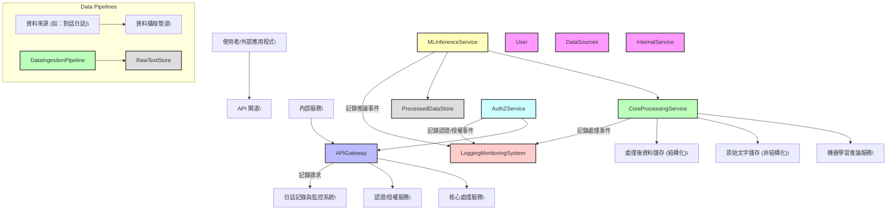
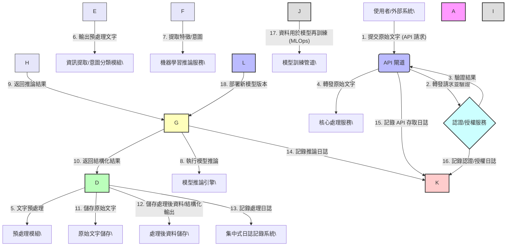

# NLP Data Processing and Inference Platform

This project is an implementation of the "NLP Data Processing and Inference Platform" as described in the system specification document.

## System Architecture

Below are the architecture diagrams for the system. These diagrams are rendered from text using Mermaid.js.

### High-Level Component Diagram

### Data Flow Diagram

