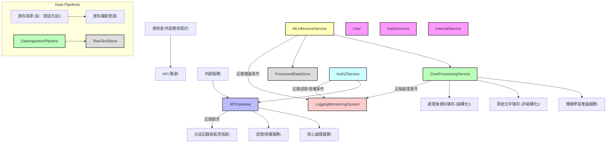
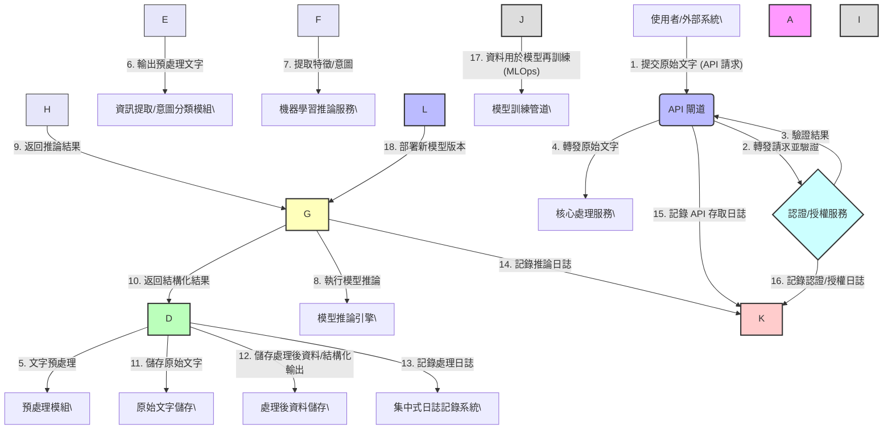

# 自然語言處理之資料處理與推論平台

本專案是基於提供的系統規格書所實現的「自然語言處理之資料處理與推論平台」。

## 系統架構

以下為本系統的架構圖。這些圖表是透過 Mermaid.js 從文字語法渲染而成。

### 高階元件圖



### 資料流圖



## 安裝與設定

請依照以下步驟設定並執行 `core_processing_service`。

1.  **進入核心處理服務目錄**

    ```bash
    cd core_processing_service
    ```

2.  **建立虛擬環境**

    本專案建議使用 `uv` 來管理虛擬環境與套件。請先確保您已安裝 `uv`。

    使用 `uv` 建立一個名為 `.venv` 的虛擬環境：
    ```bash
    uv venv
    ```

3.  **啟用虛擬環境**

    ```bash
    source .venv/bin/activate
    ```
    啟用後，您的終端機提示符前應會顯示 `(.venv)`。

4.  **安裝依賴套件**

    使用 `uv` 安裝 `requirements.txt` 中定義的套件：
    ```bash
    uv pip install -r requirements.txt
    ```

## 執行服務

在啟用虛擬環境並安裝完所有依賴套件後，您可以使用 `uvicorn` 來啟動本地開發伺服器。

```bash
uv run uvicorn main:app --reload
```

`--reload` 參數會讓伺服器在偵測到程式碼變更時自動重啟，非常適合開發環境。

服務啟動後，您可以前往 [http://127.0.0.1:8000/docs](http://127.0.0.1:8000/docs) 查看自動產生的 API 文件。
