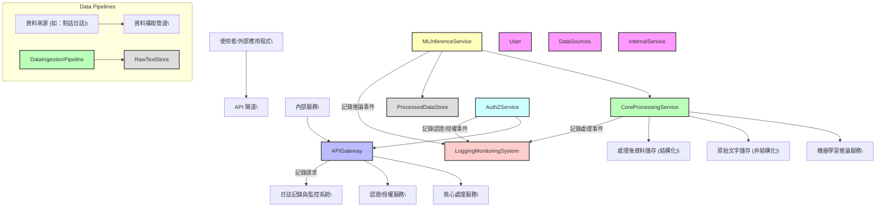
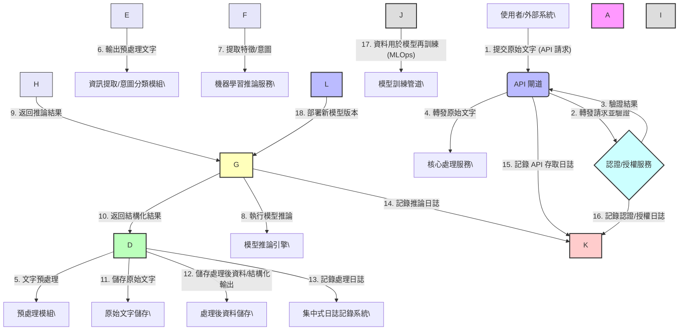

# 自然語言處理之資料處理與推論平台

本專案是基於提供的系統規格書所實現的「自然語言處理之資料處理與推論平台」。

## 系統架構

以下為本系統的架構圖。這些圖表是透過 Mermaid.js 從文字語法渲染而成。

### 高階元件圖



### 資料流圖



## 後端服務 (`backend/`)

此目錄包含使用 FastAPI 建置的核心後端服務。

### 本地開發

#### 環境需求

-   Python 3.12
-   虛擬環境管理工具 (例如 `venv` 或 `uv`)

#### 設定與執行服務

1.  **進入後端服務目錄**

    ```bash
    cd backend
    ```

2.  **啟用虛擬環境**

    本專案已包含一個預先設定好的虛擬環境。執行以下指令來啟用它：
    ```bash
    source .venv/bin/activate
    ```
    啟用後，您的終端機提示符前應會顯示 `(.venv)`。

3.  **安裝依賴套件**

    啟用虛擬環境後，安裝所需的套件。
    (建議使用 `uv`)
    ```bash
    uv pip install -r requirements.txt
    ```
    或者，您也可以使用 `pip`:
    ```bash
    pip install -r requirements.txt
    ```

4.  **設定 Firebase 憑證 (若有需要)**

    如果服務需要連接到 Firebase，請遵循 `INSTRUCTIONS_FIREBASE.zh-TW.md` 中的說明，在此目錄中設定您的 `firebase-credentials.json` 檔案。

5.  **執行開發伺服器**

    使用 `uvicorn` 來執行 FastAPI 應用程式。`--reload` 參數會在偵測到程式碼變更時自動重啟。
    ```bash
    uvicorn app.main:app --reload --host 0.0.0.0 --port 8000
    ```

    服務啟動後，您可以前往 [http://127.0.0.1:8000/docs](http://127.0.0.1:8000/docs) 查看自動產生的 API 文件。

### 執行測試

若要執行自動化測試，請使用以下指令：

```bash
python3 -m unittest backend/tests/test_tree_engine.py
```

### 填充 Firestore 資料庫

您可以執行填充指令碼，將初始資料填入您的 Firestore 資料庫。在執行此操作前，請確保您的 Firebase 憑證已正確設定。

```bash
python3 backend/scripts/seed_firestore.py
```

此指令碼會在您的 Firestore 資料庫中建立必要的集合與文件。如果資料已存在，腳本不會進行覆寫。
