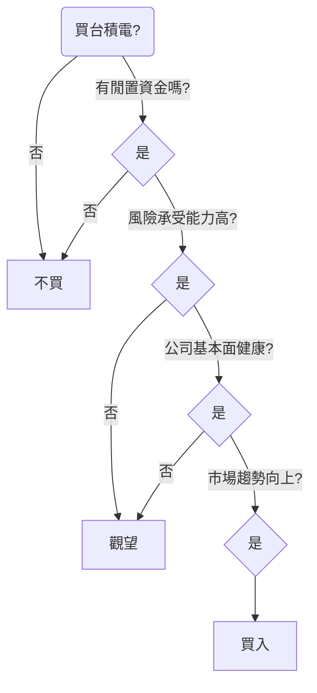
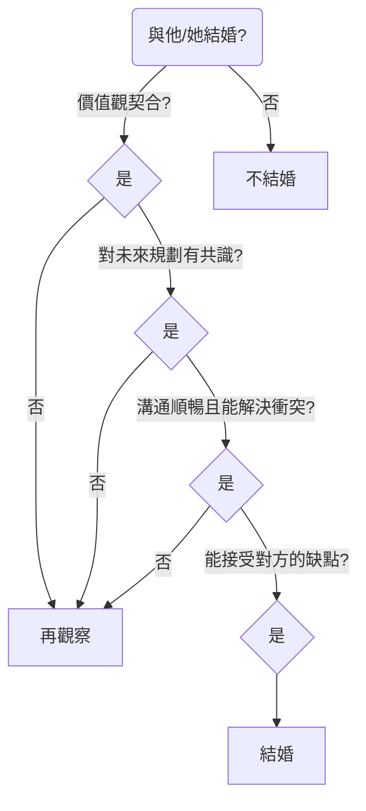
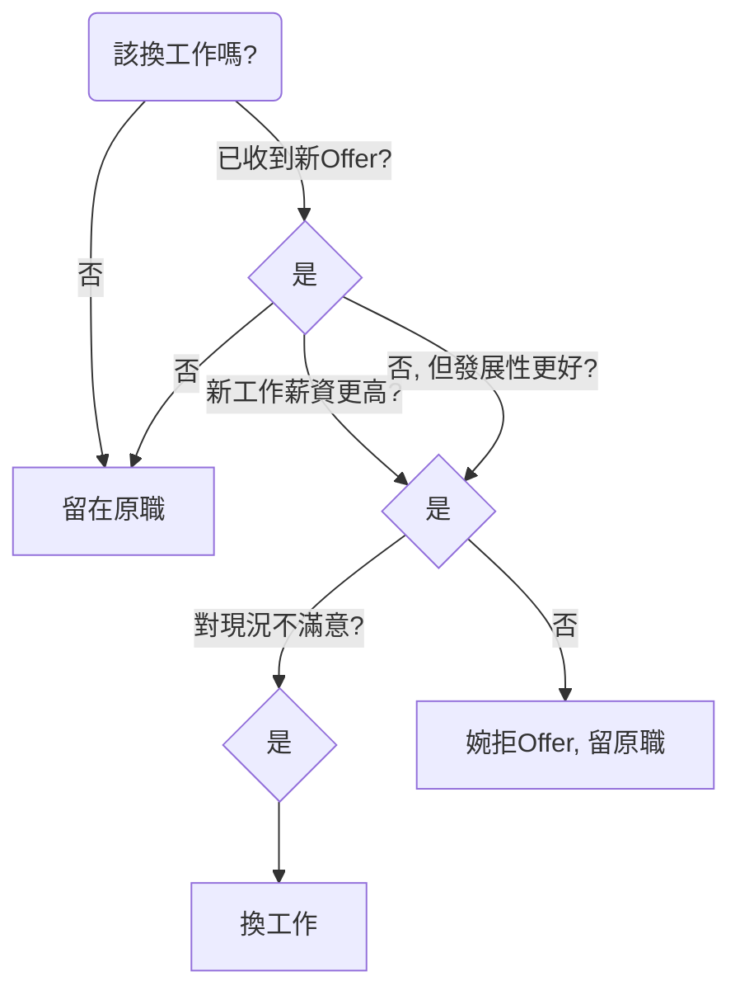
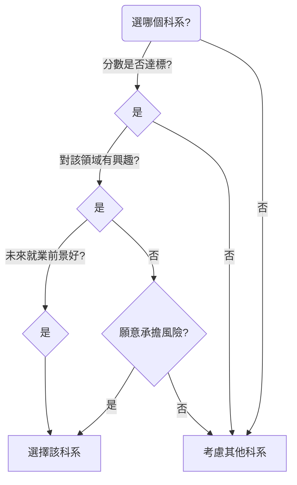
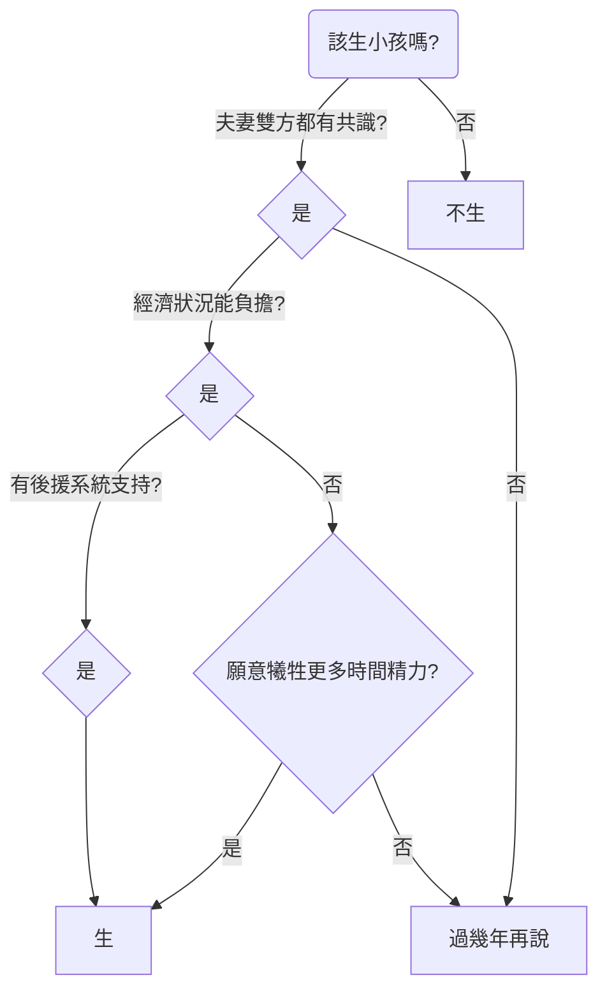

您好！這是一個非常有趣的問題。我很樂意基於我們系統規格書中描述的「決策樹」原理，為您設計這五個生活決策的範例。

決策樹的核心是透過一系列的問題（特徵），將一個複雜的決策拆解成多個簡單的、二元的選擇，最終引導到一個結論（葉節點）。以下是我為您設計的五個決策樹模型，並使用 Mermaid.js 語法將其視覺化。

---

### **1. 買的台積電股票是否正確**

這個決策樹旨在評估當下是否為買入台積電 (TSMC) 股票的好時機。它會考慮個人的財務狀況、市場趨勢和公司基本面。

**主要決策特徵：**
*   **個人財務狀況：** 是否有閒置資金？風險承受能力如何？
*   **公司基本面：** 近期營收、毛利率是否成長？
*   **市場與技術指標：** 目前股價是否處於相對低點？市場氣氛是牛市還是熊市？

**決策樹範例圖：**

---

### **2. 是否要與眼前的伴侶結婚**

這個決策樹幫助使用者思考與伴侶結婚的關鍵因素，重點在於價值觀、溝通和未來規劃的契合度。

**主要決策特徵：**
*   **核心價值觀：** 在金錢、家庭、道德等重大議題上是否一致？
*   **未來藍圖：** 對於事業、生兒育女、居住地等規劃是否有共識？
*   **溝通與衝突解決：** 是否能有效溝通？如何處理爭執？
*   **個人接受度：** 是否能包容對方的缺點與習慣？

**決策樹範例圖：**

---

### **3. 是否要換工作**

這個決策樹用於評估換工作的利弊，不僅考慮薪資，也將職涯發展、工作滿意度和機會成本納入考量。

**主要決策特徵：**
*   **現狀評估：** 對目前工作的滿意度如何（薪資、文化、內容）？
*   **新機會評估：** 新工作的薪資、職位、發展性是否更好？
*   **機會確定性：** 是否已經取得正式的錄取通知 (Offer)？

**決策樹範例圖：**

---

### **4. 基於聯考要選哪個科系**

這個決策樹模型協助考生根據自身的分數、興趣和未來的就業市場來選擇大學科系。

**主要決策特徵：**
*   **學術表現：** 分數是否達到科系的錄取門檻？
*   **個人興趣：** 對該領域是否有熱情與好奇心？
*   **職涯發展：** 該科系的畢業生就業前景與薪資水平如何？
*   **個人能力：** 我的強項能力是否與科系要求相符？

**決策樹範例圖：**

---

### **5. 該不該生小孩**

這是一個複雜的家庭決策。決策樹會從務實的層面，如經濟、時間和夫妻共識來進行評估。

**主要決策特徵：**
*   **夫妻共識：** 雙方是否都真心想要小孩？
*   **經濟狀況：** 家庭收入是否能支撐養育小孩的開銷？
*   **生活方式：** 是否有足夠的時間、精力與心理準備？
*   **後援系統：** 是否有家人或外部資源可以協助？

**決策樹範例圖：**

